# 🎓 CE5 Group 6 Capstone Project - Albert Shoes Shop Chatbot with Sentiment Analysis API

This project consists of a [chatbot application](./chatbot/README.md) and
a [sentiment analysis API](./api/README.md).
Both applications are containerized using Docker and are deployed to AWS EKS
cluster using GitHub Actions.  
The technologies used in this project include but
are not limited to:

- Git
- GitHub Actions
- Terraform
- AWS EKS, ECR, EC2, S3, DynamoDB, Comprehend etc
- Docker
- Kubernetes
- Helm
- Python
    - Flask
    - Streamlit
    - LangChain
- OpenAI
- Others

## Table of Contents

1. [Overview](#-overview)
2. [Git Flow Branching Strategy](#-git-flow-branching-strategy)
3. [Agile Development Process](#-agile-development-process)
4. [GitHub Actions Workflows](#-github-actions-workflows)
5. [Terraform Infrastructure as Code](#-terraform-infrastructure-as-code)
6. [Running the App Locally](#-running-the-app-locally)
7. [Future Improvements](#-future-improvements)
8. [Learning Points](#-learning-points)

## 👀 Overview

The diagram below shows the architecture of the project:

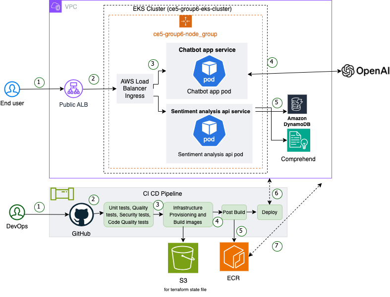

## 🌿 Git Flow Branching Strategy

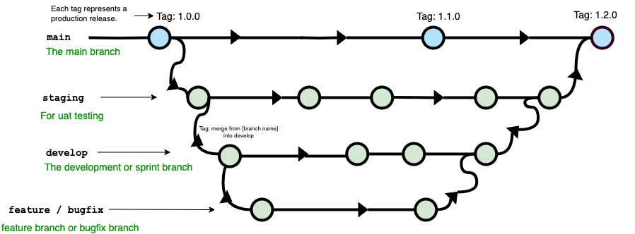

Our main branch for development is the `develop` branch. Here's how the
branching strategy works:

- **Feature and Bugfix Branches**:
    - Create feature branches and bugfix branches from the `develop` branch.
    - Implement changes in these branches and merge them back into `develop`.

- **Staging Branch**:
    - Merge the `develop` branch, containing the latest changes from feature and
      bugfix branches, into the `staging` branch for UAT (User Acceptance
      Testing).

- **Main Branch**:
    - After UAT testing passes, merge the `staging` branch into the `main`
      branch.
    - Tag the `main` branch with the release version.

This workflow ensures a structured and efficient process for managing
development, testing, and releases.

Branch protection rules are set up to enforce this workflow
for `develop`, `staging` and `main` branch.

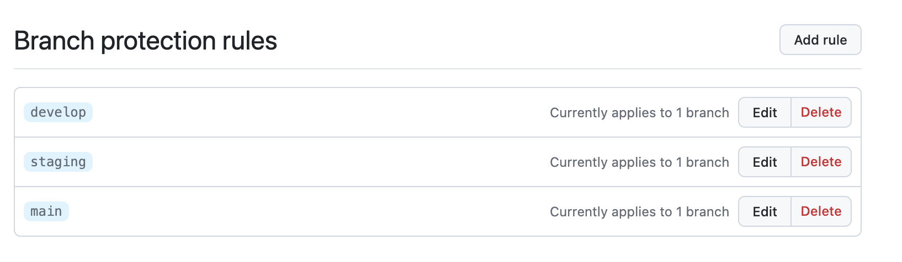

It requires at
least
one approval and passing of the CI/CD checks before merging into the `develop`,
`staging` and `main` branch.
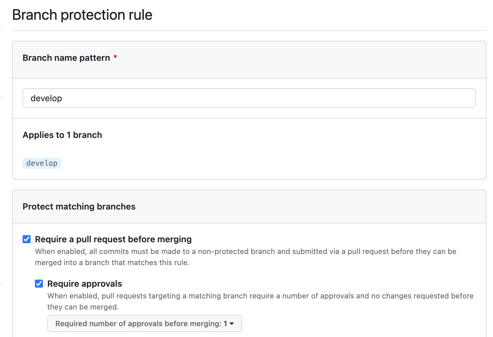

### 🔄 Agile Development Process

Our team **ALBERT TEAM** consists of 3 members:

- Albert Leng - Product Owner
- Leng Zai - Developer
- Luqman - Scrum Master (*the 👑 big boss 🕶️*)  
  *(Note: The members mentioned are fictitious and used for illustrative
  purposes
  only.)*

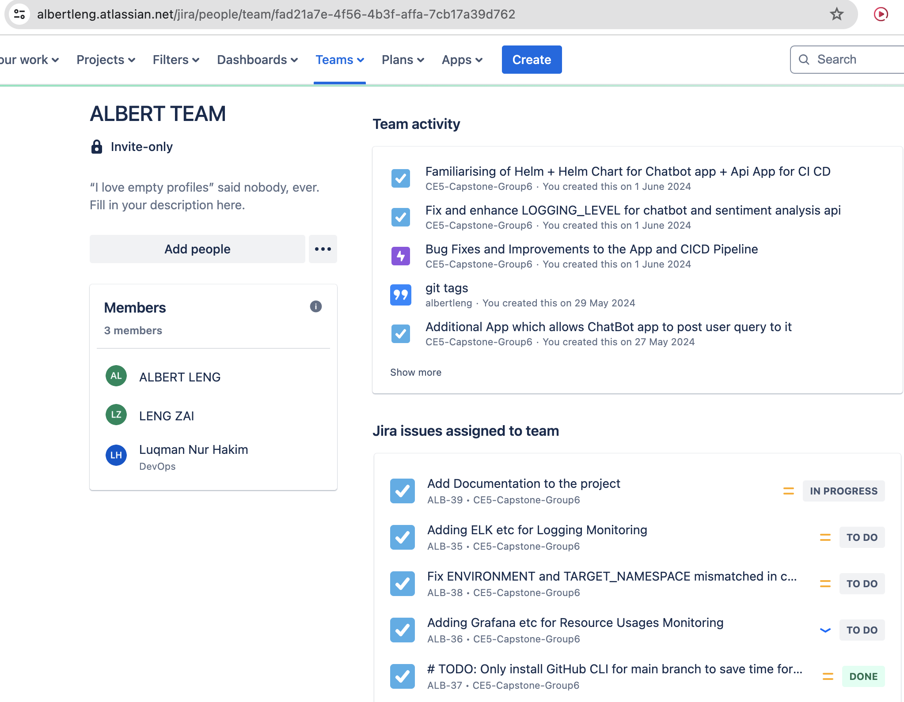

JIRA is used to manage the project. The project is divided into Epics and Tasks
(also known as Tickets) which are assigned to team members. The progress of the
project is tracked using the JIRA board.

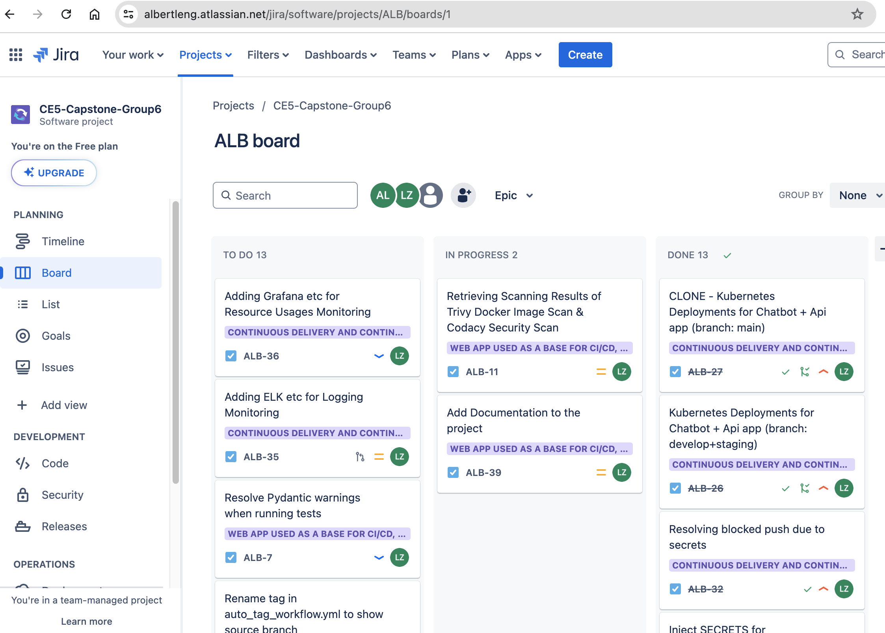

Each ticket is assigned to a team member and has a status that indicates the
progress. It is moved from one status to another as the work progresses. It also
consists of priority, descriptions and comments.

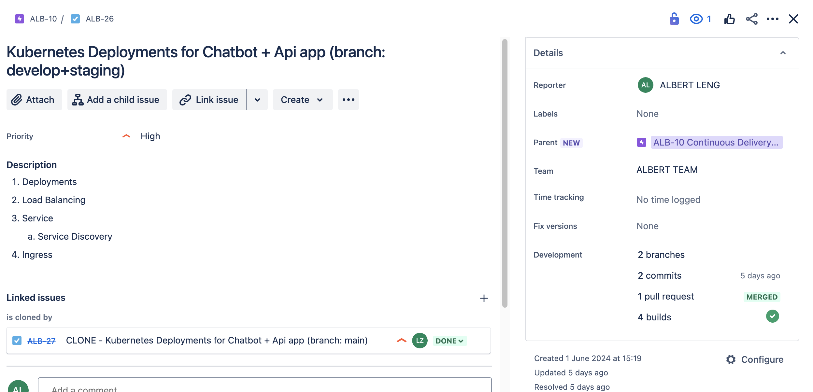

We integrate JIRA with GitHub to link commits and pull requests to JIRA issues
for streamlined tracking and visibility.

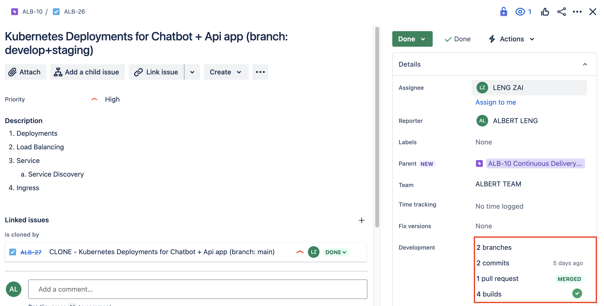

## 🚀 GitHub Actions Workflows

This project uses several GitHub Actions workflows for

- **branch protection rules**,
- **continuous integration (CI)**,
- **continuous deployment (CD)**, and
- **automatic tagging**

In each check-in, we use helm [values.yml](./helm/values.yaml) and
[Chart.yml](./helm/Chart.yaml) to specify the environment and version.
These information will be used to tag the docker images pushed to ECR and
helm chart.

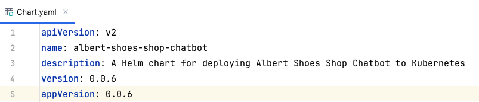  
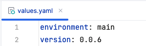

Here's an overview of what each workflow does:

### 🛡️ Branch Protection Rules

The `branch_protection_rules.yml` workflow is triggered on pull requests to
the 🌳 `develop`, `staging`, and `main` branches. It includes a job that
validates the name of the source branch of the pull request based on the target
branch.
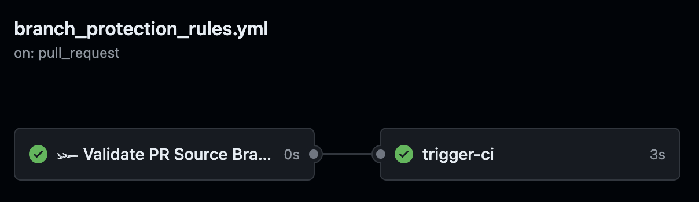

### 🧪 Continuous Integration (CI)

The `ci.yml` workflow is triggered on `repository_dispatch` events with the
type `branch-rules-checked`. It includes several jobs:
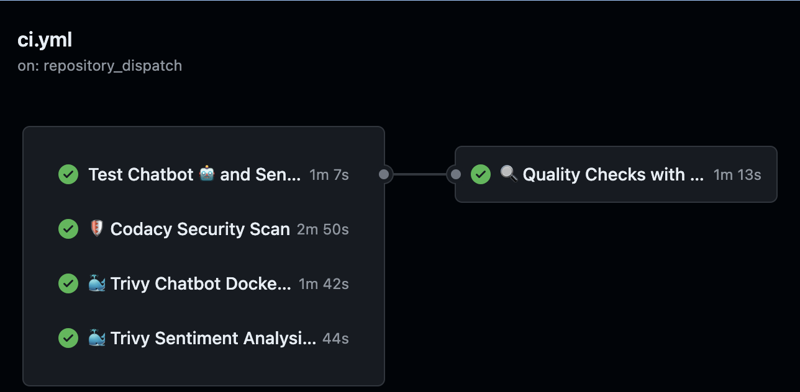

- `test-services`: This job sets up Python, installs dependencies, and runs unit
  tests for the 🤖 Chatbot and 📊 Sentiment Analysis API.
- `codacy-security-scan`: This job checks out the code and runs the Codacy
  Analysis CLI to perform a 🔒 security scan.
- `trivy-chatbot-docker-image-scan` and `trivy-api-docker-image-scan`: These
  jobs build 🐳 Docker images for the Chatbot and Sentiment Analysis API,
  respectively, and then run the 🔍 Trivy vulnerability scanner on the images.
- `quality-checks`: This job checks out the code, sets up Python, installs
  dependencies, and then performs several 📝 quality checks, including formatting
  the code with Black, performing a security check with Bandit, and linting the
  code with Pylint.

### 🚀 Continuous Deployment (CD)

The `cd.yml` workflow is triggered on pull requests to the `develop`, `staging`,
and `main` branches. It includes several jobs:
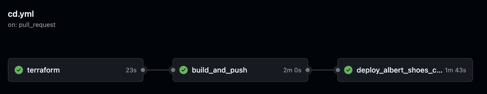

- [terraform](./terraform): This job checks out the code, configures AWS
  credentials, sets up
  🌍 Terraform, and then runs `terraform init`, `terraform plan`,
  and `terraform apply`.
- `build_and_push`: This job checks out the code, configures AWS credentials,
  sets up the shell, and then runs a [script](./build_and_push_docker_images.sh)
  to 🏗️ build and push Docker images.
- `deploy_albert_shoes_chatbot`: This job checks out the code, 🚁 sets up Helm,
  installs the helm-secrets plugin, installs sops, decrypts secrets, replaces
  placeholders in `values.yaml`, checks and uninstalls namespaces if they exist,
  and then deploys the Helm chart.

### Auto Tag 🏷️

The `auto_tag_workflow.yml` workflow is triggered when pull requests are closed.

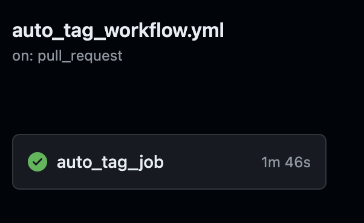

It includes a job that automatically creates a 🎁 tag for the merge commit if the
pull request was merged into the `main`, `develop`, or `staging` branch.
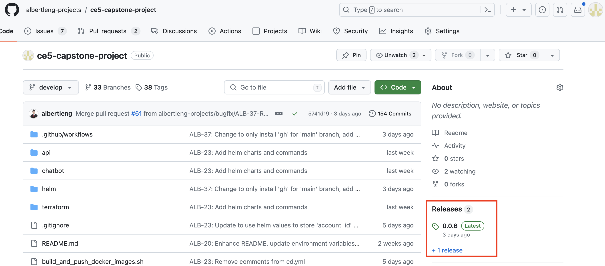    
If the
pull request was merged into the `main` branch, it also creates a GitHub release
for the new tag.
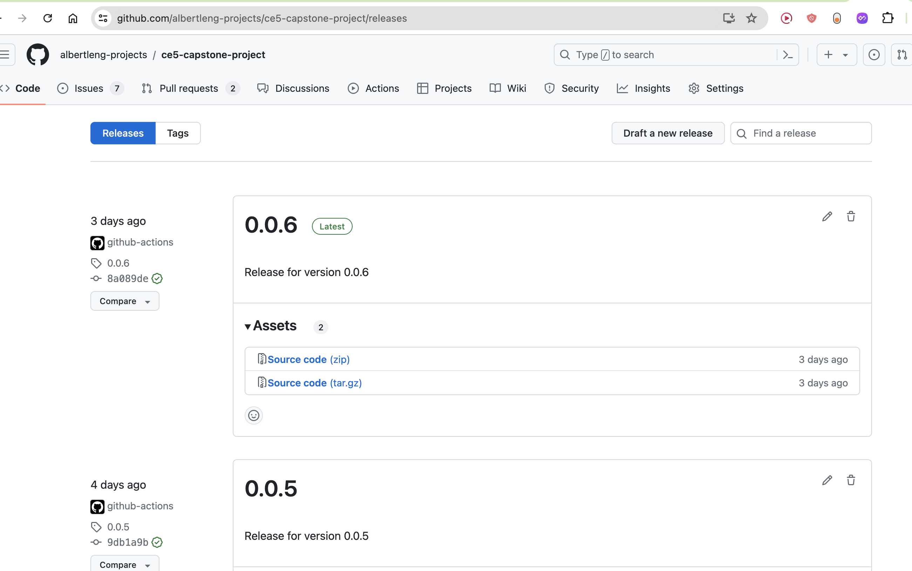

## 🌐 Terraform Infrastructure as Code

This [main.tf](./terraform/main.tf) file contains the Terraform configuration
for creating an
Amazon EKS (Elastic Kubernetes Service) cluster in the AWS (Amazon Web Services)
cloud.

In addition to this file, we also use
another [terraform project to create the vpc for the EKS cluster](https://github.com/albertleng-projects/create-vpc-for-eks).

### 📝 Overview

The configuration includes the following main sections:

1. **🔌 Provider Configuration**: This section specifies the cloud provider to
   use (in this case, AWS) and the region where the resources will be created.

2. **💾 Terraform Backend Configuration**: This section configures the backend
   for storing the Terraform state. It uses an S3 bucket in AWS for this
   purpose.

3. **🔍 Data Sources**: This section fetches data from existing resources. It
   fetches data about the EKS cluster and its authentication details.

4. **📌 Local Values**: This section defines local values that can be used
   throughout the configuration.

5. **🐳 Kubernetes Provider**: This section configures the Kubernetes provider
   using the EKS cluster details fetched in the data sources section.

6. **🚀 EKS Module**: This section uses the EKS module from the Terraform AWS
   modules collection to create an EKS cluster.

7. **📁 Kubeconfig File**: This section creates a local kubeconfig file that can
   be used to interact with the EKS cluster using kubectl.

### 🛠️ Usage

To use this configuration, you need to have Terraform installed on your machine.
You can then initialize Terraform in the directory containing this configuration
file using the `terraform init` command. After initialization, you can create
the resources defined in the configuration using the `terraform apply` command.

Please note that you need to have valid AWS credentials configured on your
machine to use this configuration. You can configure your AWS credentials by
setting the `AWS_ACCESS_KEY_ID` and `AWS_SECRET_ACCESS_KEY` environment
variables.

### 🏗️ Resources Created

This configuration creates the following main resources:

- An Amazon EKS cluster
- An Amazon S3 bucket for storing the Terraform state
- A local kubeconfig file for interacting with the EKS cluster

### 📚 Variables

This configuration uses the following main variables:

- `AWS_ACCESS_KEY_ID`: The AWS access key ID.
- `AWS_SECRET_ACCESS_KEY`: The AWS secret access key.
- `AWS_REGION`: The AWS region where the resources will be created.

### 📤 Outputs

This configuration outputs the path to the kubeconfig file created.

## 🚀 Running the App Locally

You can also run the chatbot and sentiment analysis API locally using Docker
Compose.
Refer to its [README](./README-docker-compose.md) for more information

## 🧠 Learning Points

- **Infrastructure as Code (IaC)**: Learn to use Terraform for AWS EKS cluster
  management.
- **CI/CD Automation**: Understand GitHub Actions for automated testing, Docker
  image building, and EKS deployment.
- **Containerization**: Explore Docker for application containerization,
  ensuring
  portability.
- **Kubernetes Orchestration**: Gain insights into Kubernetes for scalable
  application management.
- **Agile Project Management**: Utilize JIRA for agile methodologies, enhancing
  team
  collaboration.

## 🌟 Future Improvements

- [ ] Add ELK stack for logging and monitoring
- [ ] Add Prometheus and Grafana for monitoring
- [ ] Add more tests for the Chatbot and Sentiment Analysis API
- [ ] Add DNS names using AWS Route 53
- [ ] Add more features to the Chatbot and Sentiment Analysis API
    - [ ] Add Authentication and Authorization
    - [ ] Add persistent storage for user data 