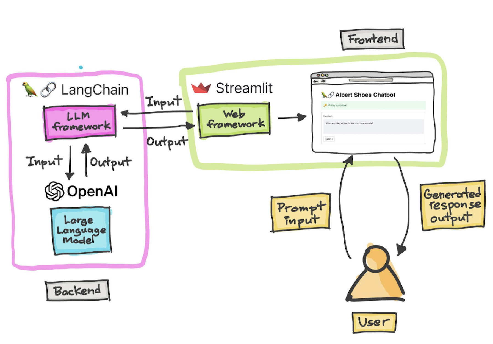

## Project : Albert Shoes Shop Chatbot  *(built with OpenAI, LangChain and Streamlit)*

## 💻 Project Overview

Welcome to Albert Shoes Shop Chatbot, a sophisticated tool powered by OpenAI,
LangChain, and Chroma. This chatbot is designed to provide accurate and
contextually relevant responses to user queries.

- **OpenAI**: The chatbot utilizes the OpenAI API to generate intelligent and
  relevant answers to a wide range of questions.
- **LangChain**: With the help of LangChain, our chatbot supports multilingual
  interactions, translating user queries and responses between English and other
  languages.
- **Streamlit**: The chatbot is deployed as a web application using Streamlit,
  hosted in AWS. It allows users to interact with the chatbot through a
  user-friendly interface.

## Architectural Diagram



## 🛠️ Requirements : Installation & Setup

### [Python 3.10.0](https://www.python.org/downloads/release/python-3100/)

### packages

- **LangChain** :[LangChain](https://www.langchain.com/) is an open-source
  framework for developing applications powered by Large Language Models (LLMs).
  LangChain simplifies various stages of the LLM application lifecycle, from
  development and productionization to deployment. It provides building blocks
  and components to construct LLM-powered apps.
- **OpenAI
  ** : [OpenAI](https://python.langchain.com/docs/integrations/platforms/openai)
  is a Python library that provides a simple interface to the OpenAI API. It
  also provides a command-line interface (CLI) for interacting with the API.
- **python-dotenv** : [python-dotenv](https://pypi.org/project/python-dotenv/)
  is a Python library that loads environment variables from a .env file. It is
  used to load the OpenAI API key from the .env file.
- **Streamlit** : [Streamlit](https://streamlit.io/) is a Python library that
  makes it easy to create and share beautiful, custom web apps for machine
  learning and data science. It is used to create the web app.

## 🌐 Create a virtual environment & activate the virtual environment (Optional) :

```bash
python -m venv env
source env/bin/activate
```

## 🏗️ Installation:

### Install [Python 3.10](https://www.python.org/downloads/release/python-3100/) (preferable)

`Note: This project was developed and tested using Python 3.10.0.`

```bash
pip install -r requirements.txt
```

## [🔑 Get an API key](https://platform.openai.com/account/api-keys)

### Set the key as an environment variable:

```bash
export OPENAI_API_KEY='your_openai_api_key'
```

.env file:

```bash
OPENAI_API_KEY=[your_openai_api_key]
```

## 📝 Run unit tests:

```bash
pytest tests/
```

or run by ignoring warnings

```bash
pytest -p no:warnings tests/
```

## ▶️ start streamlit app on localhost:8501:

```bash
streamlit run app/app.py
```

## 🌐 Access App:

After starting the app, visit `http://localhost:8501`

This opens the app in your browser. Have fun! 😎  


## 🐳 Alternatively, using Docker:

### Build the container image:

```bash
docker build -t chatbot-app .
```

### Run the container:

```bash
docker run -p 8501:8501 -e OPENAI_API_KEY=<openai_api_key> chatbot-app
```   